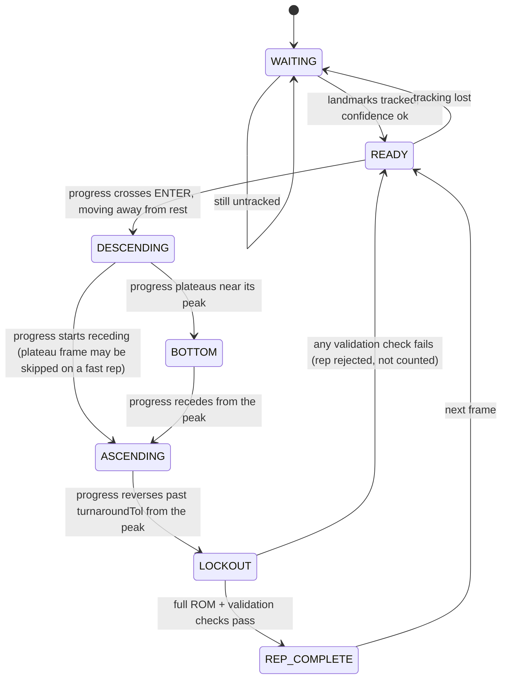
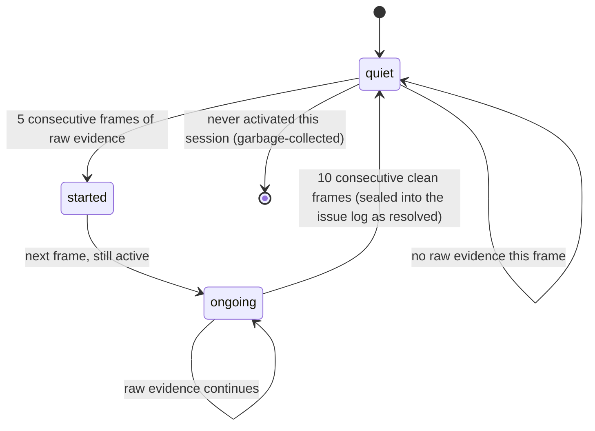
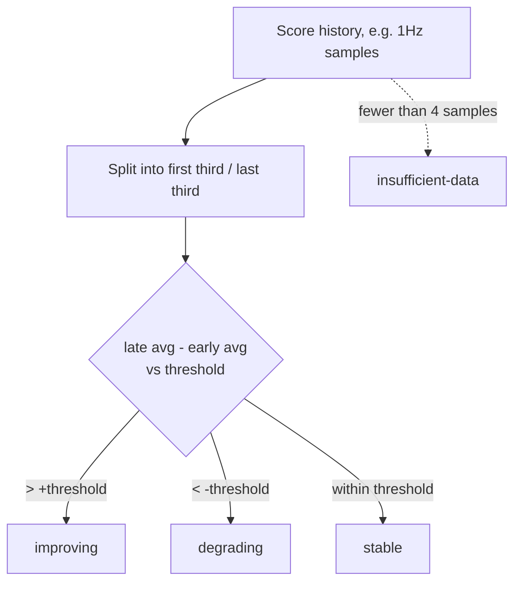
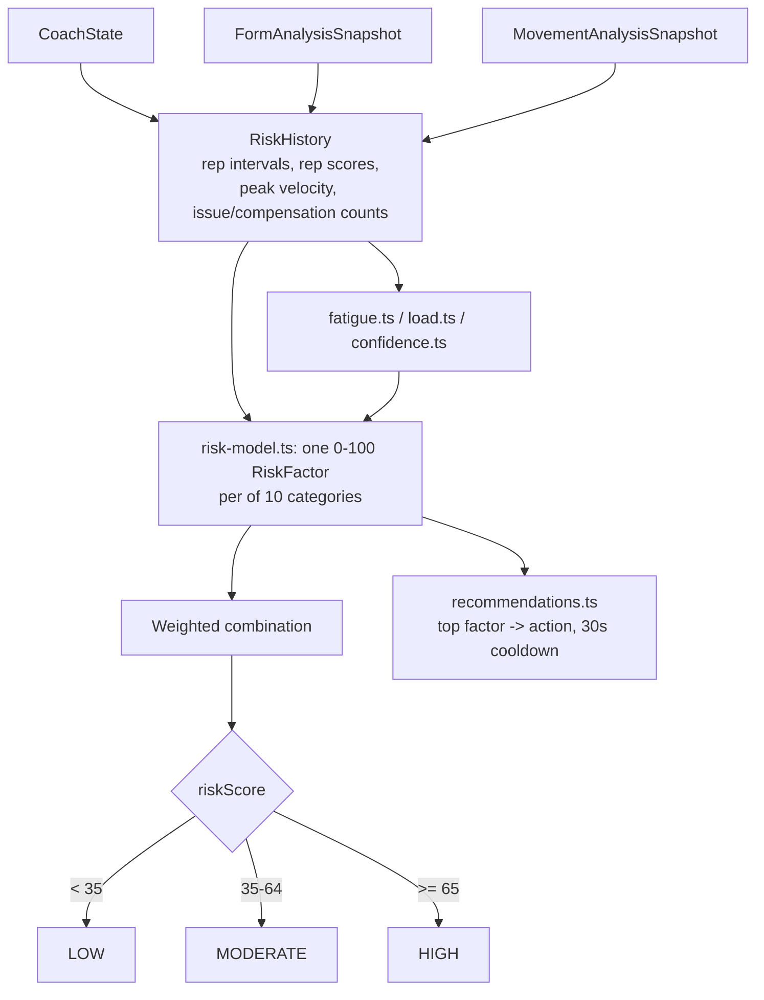
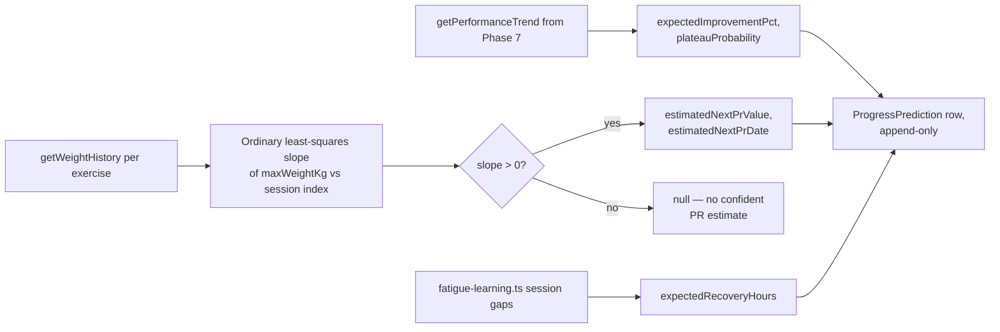
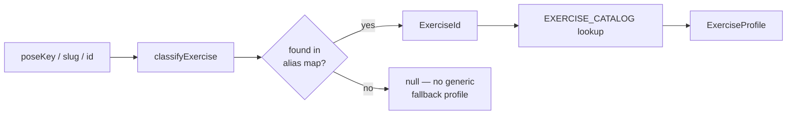
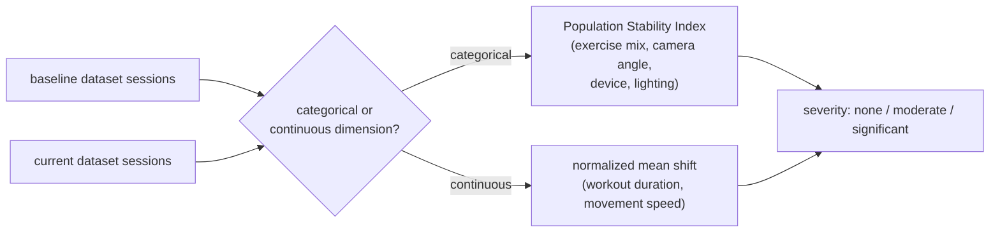
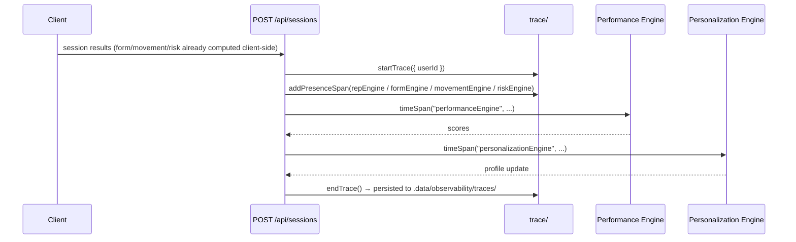

# Rep Detection Algorithm

This document describes the named state machine and validation logic used by
the AI trainer's rep-counting engine (`src/lib/pose/rep-counter.ts`,
`src/lib/pose/state-machine.ts`). It covers `type: "rep"` exercises (squat,
bench press, deadlift, push-up, pull-up, shoulder press, curl, lateral raise,
row, and everything else configured in `src/lib/pose/exercises.ts`). Hold
exercises (plank) and unmapped/generic exercises use separate, simpler logic
(`updateHold`/`updateGeneric` in `rep-counter.ts`) not covered here.

## Design principle: state machine over the existing signal, not a new algorithm

The underlying detector is a **bottom-turnaround (extremum) tracker**: it
follows a single `progress` value (0 = resting position, 1 = fully worked
position, computed from a smoothed joint angle) and counts a rep the instant
`progress` reverses far enough (`turnaroundTol`) after crossing the required
depth — no pause or full lockout return is required. This is deliberate: it
keeps counting responsive on heavy, grinding reps.

The named states below are a **transparent relabeling of that same signal**,
not a stricter replacement. `REP_COMPLETE` fires at exactly the frame the
underlying tracker already accepted a rep. This preserves gym-tested
behavior for every exercise while giving the state machine, validation
checklist, and debug HUD asked for in this phase.

## States



`BOTTOM` is a display nicety, not a gate: on a fast, explosive rep the
plateau may last under one frame and simply not appear — `DESCENDING` goes
straight to `ASCENDING`. This never affects whether a rep counts.

## Rejection at LOCKOUT

When the tracker reverses out of the bottom, the following checks run **in
this order**, each returning to `READY` immediately without incrementing the
rep counter if it fails. Reused from the existing, gym-tested logic unless
noted otherwise:

| # | Check | Rejection code | Existing / new | Gated by strict mode? |
|---|---|---|---|---|
| 0 | Peak reached minimum depth (`MIN_REP_PEAK`) | *(silent — no event, matches prior behavior)* | Existing | No |
| 1 | Full range of motion (`peak >= reqProgress`) | `rom_too_small` | Existing | No |
| 2 | No unsafe form errors (Advanced mode, high-confidence only) | `unsafe_form` | Existing | No (Advanced-mode-only, as before) |
| 3 | Controlled tempo (`MIN_REP_INTERVAL_MS`, 450ms) | `too_fast` | **New** | **Yes — off by default** |
| 4 | Stable, no excessive swing (`MIN_STABILITY`, 40/100) | `unstable` | **New** | **Yes — off by default** |

With **Strict rep validation** off (the default — toggle in Developer
Settings), checks 3 and 4 are computed and shown in the debug HUD / JSON
export but never reject a rep, so accept/reject behavior is identical to
before this phase. Turning it on makes them real gates.

Every decision — accepted or rejected — carries a `ValidationResult` with a
pass/fail entry for all five factors (ROM, confidence, tempo, stability,
form), regardless of which ones are currently gating, so the debug HUD always
shows the full picture.

## Confidence

Three distinct numbers, all surfaced in `RepDebugInfo`:

- **Pose confidence** — current frame's minimum joint-triple keypoint score.
  Answers "can I trust this frame's landmarks right now."
- **State confidence** — 0–100, consecutive frames the current named state
  has held (capped at `SUSTAIN` frames). Answers "how settled is the current
  state classification," not a gate — just an indicator that the state may
  still be a one-frame flicker.
- **Rep confidence** — average landmark confidence over the whole rep
  attempt (existing `confidence` field), used by the existing unsafe-form
  gate (`HIGH_CONF`).

## Per-exercise parameters

One generic state machine, parameterized per exercise via the existing
`RepConfig` in `lib/pose/exercises.ts` — not nine separate implementations.
`turnaroundTol` is the main lever that changes exercise "feel": a larger
value tolerates more grind/pause near the bottom of a heavy lift before
treating it as a rep.

| Exercise | poseKey | Joint | Start° | Active° | Ideal° | turnaroundTol |
|---|---|---|---|---|---|---|
| Squat | `squat` | hip-knee-ankle | 160 | 100 | 70 | 0.10 (default) |
| Bench press | `bench-press` | shoulder-elbow-wrist (3D) | 158 | 100 | 82 | 0.14 |
| Deadlift | `deadlift` | shoulder-hip-knee | 165 | 110 | 90 | 0.10 (default) |
| Push-up | `push-up` | shoulder-elbow-wrist | 160 | 100 | 80 | 0.10 (default) |
| Pull-up | `pull-up` | shoulder-elbow-wrist | 160 | 80 | 55 | 0.10 (default) |
| Shoulder press | `shoulder-press` | shoulder-elbow-wrist (3D, wrist-above-shoulder gate) | 90 | 140 | 165 | 0.16 |
| Curl | `curl` | shoulder-elbow-wrist | 150 | 70 | 45 | 0.10 (default) |
| Lateral raise | `lateral-raise` | hip-shoulder-wrist | 25 | 80 | 90 | 0.10 (default) |
| Row | `row` | shoulder-elbow-wrist (3D) | 160 | 80 | 60 | 0.14 |

("3D" = angle measured from BlazePose world landmarks when available —
depth-invariant, avoids foreshortening from a side/45° camera.)

## Tuning constants (`REP_TUNING`)

Exported from `rep-counter.ts`, stamped into every debug JSON export so a
threshold change is always traceable to the exact session it produced:
`ENTER, TURN, MIN_REP_PEAK, MIN_CONF, SMOOTH, SUSTAIN, HIGH_CONF, CHECK_FROM,
MIN_REP_INTERVAL_MS, MIN_STABILITY`. All values unchanged from before this
phase except the two new ones (`MIN_REP_INTERVAL_MS` = 450, hoisted from an
inline constant with the same value; `MIN_STABILITY` = 40, new and only
active in strict mode).

---

# Form Analysis Engine (Phase 4)

`src/lib/pose/form-engine/` — a standalone module that watches the *whole*
repetition (not just the bottom-turnaround decision) and scores movement
quality, detects technique errors, and generates coaching. It has no
knowledge of rep counting and never writes to the Rep Engine, State Machine,
or Calibration Engine described above — it only reads their already-exported
telemetry (`CoachState`, `CalibrationProfile`). See `SYSTEM_ARCHITECTURE.md`
for the module map and `DEVELOPER_GUIDE.md` for how to add a new exercise.

## Detection pipeline

Once per frame, `FormEngine.analyzeFrame(keypoints2D, keypoints3D, coachState, now)`:

1. **Joint metrics** (`joint-metrics.ts`, stateless) — builds normalized
   angles/tilts/ratios (shoulder & hip tilt, torso lean, back angle, body
   line, knee-valgus ratio, elbow-flare angle, heel/toe-vs-ankle height,
   ear-shoulder gap) from the same 2D/3D keypoints the Rep Engine already
   has. Distance-based metrics self-normalize against the subject's own
   torso length each frame, so the same fault reads the same regardless of
   how close the camera is — no dependency on the Calibration Engine's
   stored profile.
2. **Generic issues** (`issues.ts`) — exercise-agnostic checks (uneven
   shoulders/hips, knee valgus/varus, head/neck position, loss of balance,
   core instability, heel/toe lift) run for every exercise, including ones
   with no dedicated profile.
3. **Exercise-specific issues** (`exercises/*.ts`) — one file per exercise
   family (squat, bench press, deadlift, push-up, pull-up, shoulder press,
   barbell row, lateral raise, bicep curl), each with its own expected
   movement model layered on top of the generic checks (rounded/overextended
   back, forward lean, hip/weight shift, elbow flare/too-narrow, shoulder
   elevation, incomplete lockout, partial range, torso rotation, bar-path
   deviation). A `poseKey` with no profile still gets full generic analysis.
4. **Temporal smoothing** (`temporal-tracker.ts`) turns the raw per-frame
   evidence into stable issues (see below).
5. **Scoring** (`scoring.ts`) turns the currently-active issues + sway/lean
   variance into the eight 0–100 scores.
6. **Coaching** (`coaching.ts`) optionally emits one message, cooldown-gated.

## Temporal smoothing — issue lifecycle



Rep-boundary faults that are only knowable for one or two frames
(`incompleteLockout`, `partialRange` — sampled at the `LOCKOUT`/`REP_COMPLETE`
decision) are held "sticky" for ~650ms so they still clear the 5-frame
activation bar above, rather than needing a dedicated one-frame code path.

## Severity calculation

`severity.ts` combines four inputs into `minor | moderate | major | critical`:
duration (capped at 3s), frequency (occurrences this session, capped at 5),
magnitude (0–1, how far past the fault threshold), and confidence — weighted
45/25/15/15 magnitude/duration/frequency/confidence. A confidence gate then
caps the result: below 0.5 confidence a reading can't reach `critical`; below
0.35 it can't reach `major` either. This is deliberate — see "Scientific
accuracy" below.

## Coaching logic

`coaching.ts` picks the highest-severity, highest-confidence active issue
(excluding `minor`), subject to a 9s per-issue-id cooldown and a 3.5s global
cooldown shared across all Form Engine messages — so the same correction
isn't repeated every second, and Form Engine cues never fight the Rep
Engine's own rep-praise/correction cues for the same on-screen bubble
(`live-session.tsx` only shows a Form Engine cue when no rep cue is already
visible).

## Scores

Eight 0–100 scores computed every frame (`scoring.ts`), each a 100-minus-
severity-weighted-penalty over a specific issue subset, except ROM which
reuses the Rep Engine's own `avgRom` telemetry rather than re-deriving it:

| Score | Driven by |
|---|---|
| Joint | kneeValgus, kneeVarus, elbowFlare, elbowsTooNarrow, heelLift, toeLift |
| Alignment | unevenShoulders, unevenHips, hipShift, headLookingDown, neckMisalignment, torsoRotation |
| Balance | lossOfBalance, weightShift, + rolling hip-sway std-dev |
| Stability | coreInstability, + rolling torso-lean std-dev |
| ROM | Rep Engine's `avgRom` |
| Technique | roundedBack, overextendedBack, forwardLean, shoulderElevation, barPathDeviation |
| Movement Quality | average of Balance, Stability, Technique |
| Overall | average of all seven other scores |

## Known limitations

- **Monocular RGB only** — no depth camera, no IMU. Every `DetectedIssue`
  carries a confidence value; coaching copy is phrased as guidance ("keep
  your chest up"), never a diagnosis. This is a coaching aid, not a
  biomechanics lab.
- **Forward lean vs. backward hyperextension at lockout** can't be told apart
  from a single 2D frame without a facing/mirror calibration — both surface
  as "torso not vertical at lockout." Deadlift/shoulder-press profiles bias
  the label toward the more common fault (see `exercises/deadlift.ts`).
- **Heel/toe lift and torso rotation** need foot keypoints / 3D depth that
  only the BlazePose (3D/Hybrid) pipeline provides — they're silently skipped
  on the 2D-only (MoveNet) pipeline rather than guessed at.
- **Exercise-specific thresholds are first-pass, conservative defaults** —
  not yet tuned against real gym sessions. Following the same process used
  for Phases 1–3, thresholds are only adjusted from real gym-tested JSON
  debug exports, not guessed at in isolation.
- **Weakness tracking is device-local** (`localStorage`) this phase, not
  synced across devices — see `docs/ROADMAP.md` Phase 6 candidates.

---

# Movement Intelligence Engine (Phase 5)

`src/lib/pose/movement-engine/` — a layer above the Form Analysis Engine
that understands movement *over time* within a set: smoothness, left/right
symmetry, compensation patterns, rep-to-rep consistency, and trend
direction. Explicitly the foundation for a future Injury Risk Engine, not a
replacement for anything above. It never performs pose detection itself —
`MovementEngine.analyzeFrame(coachState, formSnapshot, now)` consumes only
already-computed `CoachState` (Rep Engine / State Machine) and
`FormAnalysisSnapshot` (Form Engine), the same telemetry the Form Engine
itself already reads.

## How MIE avoids re-deriving pose data

Two small, additive extensions to the Form Engine (not behavior changes —
see `CHANGELOG.md` Compatibility) make this possible:

1. `joint-metrics.ts` gained three **dual-sided** fields the Form Engine
   itself didn't need (`kneeAngleDeg`, `elbowAngleDeg`, `hipHeightNorm`,
   each `{left, right}`) — symmetry analysis needs both sides; Form Engine's
   own checks mostly pick one "best" side.
2. `FormAnalysisSnapshot` now also carries `metrics` (that frame's already-
   computed `JointMetrics`) and `sway` (Form Engine's own rolling hip-sway/
   torso-lean variance, already computed for its Balance/Stability scores).

Everything downstream in this section reads from those two fields plus
`CoachState.progress` — zero new keypoint math.

## Movement pattern analysis

`kinematics.ts` derives velocity → acceleration → jerk by differentiating
the Rep Engine's own already-smoothed `progress` signal (0..1) across
frames — no new pose math, just calculus over a scalar the Rep Engine
already produces every frame. Jerk (rate of acceleration change) is the
standard proxy for movement smoothness: a jerky, interrupted rep has a
noisier jerk signal than a smooth, controlled one.

## Symmetry analysis

`symmetry.ts` compares the new dual-sided `kneeAngleDeg`/`elbowAngleDeg`
fields frame-by-frame, accumulating the left/right difference into a
rolling standard deviation (reuses the Form Engine's `RollingStat` utility
— see `form-engine/temporal-tracker.ts`). Dominant side is a coarse proxy:
whichever side reaches a measurably deeper (lower-angle) minimum on more of
the two tracked joints across the session — not an EMG or force
measurement.

## Compensation detection

```mermaid
flowchart LR
    A[Form Engine activeIssues this frame] --> B{Do both issues in\na compensation rule\nco-occur?}
    B -- yes, severity above minor --> C[Emit CompensationEvent\n(region, confidence, note)]
    B -- no --> D[No event]
    C --> E[8s cooldown per rule id]
```

`compensation.ts` holds a small table of issue-pairs that plausibly
indicate one body region compensating for another (e.g. `elbowFlare` +
`shoulderElevation` → shoulder compensation; `kneeValgus` + `hipShift` →
hip compensation) — see the file for the full table. This describes
*observed co-occurring behavior*, not a diagnosis. Matching only reads
Form Engine's already-detected `IssueId`s, never pose landmarks.

## Consistency analysis

`consistency.ts` runs once at session-summary time over the Form Engine's
own sealed per-rep records (`SessionFormSummary.reps`) — no per-frame work.
Rep-to-rep drift is the average absolute change in a rep's overall form
score versus the previous rep; early-vs-late drift compares the first third
of the set against the last third; tempo drift compares the gaps between
consecutive `RepFormSummary.at` timestamps.

## Trend classification



`trend.ts`'s `classifyTrend()` is the one function behind every trend label
in the session summary — applied to the Form Engine's own `scoreHistory`
for the overall trend, and to the Movement Engine's own `scoreHistory` for
each of the eight per-dimension trends.

## Scores

Eight 0–100 scores (`scoring.ts`), computed every frame from the
accumulators above — `consistency` is deliberately left neutral (100) at
the per-frame level since it's a multi-rep concept; the session summary's
`consistency.consistencyScore` (from `consistency.ts`) is the real number.
`coordination` and `efficiency` are composite proxies (blends of
smoothness/symmetry/control) rather than independently measured — true
joint-synchronization or biomechanical efficiency would need multi-joint
timing correlation this phase doesn't attempt.

## Known limitations

- **Jerk (progress signal's 3rd derivative) amplifies per-frame noise
  heavily.** The smoothness score's scale constant is a first-pass guess,
  not fitted to real data — same tuning stance as the Form Engine's
  exercise-specific bands (real thresholds only from gym-tested exports).
- **"Vertical drift" is not modeled.** Isolating unwanted vertical wobble
  from intentional rep depth change (a squat is *supposed* to move
  vertically) isn't reliable from 2D pose alone without far more
  sophisticated filtering than this phase attempts — see `stability.ts`.
- **"Center of mass" is a 2D hip-midpoint proxy**, not a true center-of-mass
  computation (would need full-body mass distribution and 3D depth).
- **"Dominant side" and "compensation" describe observed movement
  behavior with a confidence value — never a diagnosis, injury risk, or
  medical claim.** This engine is explicitly framed as the foundation for a
  future Injury Risk Engine, not that engine itself.
- **Movement-engine scores are exercise-agnostic** by design (no per-
  exercise expected models, unlike the Form Engine) — a lift with an
  intentionally asymmetric pattern (e.g. a single-arm row) will read as
  "asymmetric" without exercise-aware context to explain that's expected.

---

# Injury Risk Engine (Phase 6)

`src/lib/pose/injury-risk-engine/` — the top layer of the architecture:

```
Pose Detection -> Rep Engine -> Form Engine -> Movement Engine -> Injury Risk Engine
```

It estimates short-term **movement risk**, not injury — see "Safety
wording" below. `InjuryRiskEngine.analyzeFrame()` reads only `CoachState`
(Rep Engine / State Machine), `FormAnalysisSnapshot` (Form Engine), and
`MovementAnalysisSnapshot` (Movement Engine) — the same three inputs the
Movement Engine itself already reads, plus nothing else. It never touches
pose landmarks, MediaPipe, or any sealed engine's internals.

## Where it runs

Unlike the Form and Movement Engines (both driven from inside
`use-pose-trainer.ts`), the Injury Risk Engine is instantiated and driven
directly from `live-session.tsx`. Two of the spec's required inputs — rest
duration and current working weight — aren't part of any engine's output;
they're already tracked as component state in `live-session.tsx`
(`lastRepFlash`, `currentWeightRef`). Running the engine one level up avoids
threading those concerns through the hook, and means **this phase requires
zero changes to `use-pose-trainer.ts`, `form-engine/`, or
`movement-engine/`** — a stricter form of the "additive only" rule Phases
4-5 followed, made possible because those two engines' public output
already covered everything this phase needed.

## Risk model



`history.ts`'s `RiskHistory` is the only stateful accumulator — rolling
buffers (capped at 30 entries) of rep-to-rep interval, a per-rep composite
score (average of that rep's Form/Movement overall scores), and peak
`|velocity|` per rep (from the Movement Engine's own kinematics), plus
de-duplicated tallies of which Form issues and Movement compensations have
fired this session. A rep boundary is detected purely from
`CoachState.reps` incrementing — a public field, not a rep-counter
internal.

`risk-model.ts` computes one `RiskFactor` (0-100) per category — fatigue
from `fatigue.ts`, technique/stability/asymmetry directly from Form/
Movement scores, compensation/repeated-issue/issue-frequency from
`RiskHistory`'s tallies, velocity loss from the peak-velocity buffer's
early-vs-late-set drop — then `combineRisk()` applies a fixed weighting
(fatigue and technique deterioration weighted highest at 0.15 each) into
one 0-100 `riskScore` and a `LOW`/`MODERATE`/`HIGH` level at 35/65
thresholds.

## Fatigue model

Heuristic only — `fatigue.ts` never estimates heart rate, EMG, or any
physiological quantity. It combines: rep-interval trend (reps getting
slower), rep-score trend (declining Form/Movement quality), how little rest
preceded the current rep, elapsed session time, and rep count — each
capped and summed, not modeled from first principles.

## Confidence

`confidence.ts` blends three signals into 0-1: how many reps have been
analyzed so far (more history = more confidence, caps at 6 reps), the Form
Engine's own per-frame `confidence` (a proxy for how trustworthy the
underlying pose tracking is right now — the Movement Engine doesn't expose
its own confidence value, so this is the most direct available signal), and
how far into the session we are (caps at 60s).

## Recommendations

`recommendations.ts` maps the single highest-scoring `RiskFactor` to one
`RecommendedAction` via a fixed lookup table, subject to a 30s global
cooldown (longer than the Movement Engine's 25s coaching cooldown — a
higher-level, less frequent signal) and never firing at all when
`overallRisk` is `LOW`. A `HIGH` risk level with a dominant factor at 80+
escalates the action to `endWorkout` regardless of which category it came
from.

## Safety wording

Every string this engine can surface uses movement-risk vocabulary
("elevated movement risk", "fatigue accumulation", "technique
deterioration", "movement instability") — never the word "injury" and
never diagnostic phrasing ("you are injured," "you have a [condition]").
This is enforced by writing every string in `risk-model.ts`'s factor notes
and `recommendations.ts`'s `ACTION_TEXT` table to that vocabulary from the
start, not by a runtime filter — there is no code path that constructs
risk-related copy outside those two files.

## Scope this phase

No live end-user-facing coaching cue or session-report UI card — this
phase's spec asked for a Developer HUD section and a session-summary data
extension, not a consumer-facing surface. Risk output is visible in the dev
HUD (`live-session.tsx`, gated the same way as the Form/Movement sections)
and in the debug JSON/CSV export; it's on `SessionResult` so a future phase
can decide how (or whether) to surface it to end users.

## Known limitations

- **Heuristic, not physiological.** Fatigue/load/risk scores are weighted
  sums of movement signals, not a biomechanical or physiological model.
  Treat outputs as a coaching signal, not a clinical one — see "Safety
  wording" above.
- **Scoring weights and thresholds are first-pass, conservative defaults**,
  same tuning stance as Phases 4-5 — not yet validated against real gym
  sessions or any ground-truth risk outcome (there is no ground truth
  available from camera pose data alone).
- **Confidence is a data-availability proxy**, not a statistical confidence
  interval — it says "how much history backs this estimate," not "how
  likely this estimate is to be correct."
- **Single-exercise trainer flow only** this phase (`live-session.tsx`) —
  the freeform `workout-session/ai-set-tracker.tsx` panel has no rest-timer
  or weight-tracking concept today to feed the engine meaningfully; see
  `docs/ROADMAP.md` Phase 7 candidates.
- **Session-scoped only** — no cross-session history or persistence (unlike
  the Form Engine's `localStorage` weakness tracking). Each session starts
  the risk model from zero.

---

# Performance Intelligence & Persistence Layer (Phase 7)

`src/lib/performance/` — the first layer in this codebase that touches a
database. Everything here runs **after** a workout completes, inside an
API route handler — nothing in this layer runs during a live session, and
it never touches pose data, MediaPipe, or the Rep/Form/Movement/Injury-Risk
Engines' internals. It exists to close a gap: Phases 4-6 compute rich
per-session analysis (`SessionFormSummary`, `SessionMovementSummary`,
`SessionRiskSummary`) entirely client-side, and none of it was ever sent to
the server before this phase.

## Where it runs

```mermaid
flowchart LR
    A[Client: session ends] -->|POST /api/sessions or\n/api/workout-logs, now\nincludes formAnalysis/\nmovementAnalysis/\ninjuryRiskAnalysis| B[API route]
    B --> C[Create WorkoutSession\n/ WorkoutLog row]
    C --> D[runSessionPerformanceEngine\n(src/lib/performance/)]
    D --> E[Save SessionFormAnalysis /\nSessionMovementAnalysis /\nSessionRiskAnalysis]
    D --> F[PerformanceSnapshot,\nWeaknessHistory,\nPersonalBest, UserStatistics,\nTrendHistory]
    D --> G[Achievements]
    B --> H[JSON response incl.\nperformance summary]
```

A failure inside the Performance Engine is caught and logged, never
propagated — the core workout save (already committed by the time the
engine runs) must never be lost because of a bug in this newer, less
battle-tested layer.

## Naming collision, resolved

`WorkoutSession` and `SessionSet` already existed (Phases 1-3's persistence
work) and are load-bearing — used by both trainer flows, gamification, and
PR detection. This phase's new models attach to them via additive relation
fields rather than replacing or renaming anything. `PersonalRecord`
(existing: weight+reps only, used for XP/PR badges) is untouched; the
richer 9-category "Personal Best" concept is a new, separate model.

## Schema shape

Deep, time-series/event-log-shaped data (per-frame score history, issue
logs, risk timelines, compensation events) is stored as `Json` rather than
fully normalized into rows — at "millions of sessions" scale, exploding
1Hz score samples into individual rows would dwarf every other table for
little query benefit. Aggregate/queryable fields (scores, counts, trend
labels, categories) are normalized columns so they can be indexed and
compared directly:

| Model | Shape |
|---|---|
| `SessionFormAnalysis` / `SessionMovementAnalysis` / `SessionRiskAnalysis` | 1:1 with `WorkoutSession`; normalized score columns + `Json` for the nested arrays |
| `PerformanceSnapshot` | One row per exercise-session or whole workout; append-only, doubles as the historical log `TrendHistory` rolls up |
| `WeaknessHistory` | One row per (user, exercise-or-null, issueId); upserted every session |
| `PersonalBest` | One row per (user, exercise-or-null, category) across 9 categories |
| `TrendHistory` | One upserted "current state" row per (user, exercise-or-null) — a cached rollup, not a log |
| `UserStatistics` | One row per user — aggregates distinct from `User`'s own xp/level/streak fields |

## Performance Score (8 dimensions)

`analytics.ts`'s `computeSessionScores()` blends whatever's available for
that session — technique (Form Engine), consistency (Movement Engine's
session-level `consistency.consistencyScore`, not the neutral per-frame
`scores.consistency`), strength/volume (reps vs. target, weight used), and
recovery (Injury Risk Engine's average risk, inverted, or rest time as a
fallback) — into `exerciseScore` and `overallScore`. `workoutScore` is
computed separately once every exercise in a multi-exercise `WorkoutLog`
has been scored (`saveWorkoutSnapshot()`), as the average of that
workout's exercise scores.

## Progress Engine

Six-way classification (`rapidImprovement` / `improving` / `stable` /
`plateau` / `declining` / `regression` / `insufficientData`) from
early-vs-late-window comparison over `PerformanceSnapshot.overallScore`
history — the same statistical shape as the Movement Engine's own
`classifyTrend()`, but **not the same code**: `progress.ts` is
intentionally standalone (see "Independence from the runtime engines"
below).

## Trend Analysis

`trend-analysis.ts` computes 7-session, 30-day, and 90-day windows (each
classified via the same `classifyProgress()`), a 10-session rolling
average, and improvement/regression % (early-third vs. late-third of the
90-day window), then upserts one `TrendHistory` row per (user,
exercise-or-null) — a fast-lookup cache, not an append-only log (the log
is `PerformanceSnapshot`).

## Weakness Tracking

`weakness-tracker.ts` reconciles `WeaknessHistory` from two sources: the
Form Engine's `issueLog` (non-minor severity) and the Movement Engine's
`compensation.events`, deduped per session. Frequency increments on every
occurrence; trend is `declining` when an issue recurs more often than its
prior frequency, `improving` when less often, `stable` otherwise — a
simple frequency-delta heuristic, not a fitted model.

## Personal Best Engine

`personal-best.ts` checks 9 categories every session (highest weight, most
reps, most volume, longest workout, best technique/consistency/symmetry/
movement/performance session) and upserts whichever were just beaten.
Workout-level categories (`LONGEST_WORKOUT`, `BEST_CONSISTENCY`, etc.) use
a null `exerciseId` — see "Known limitations" for why those can't rely on
`prisma.upsert()`.

## Achievements

No new models — the existing `Achievement`/`UserAchievement` tables
already support arbitrary types via `slug`. `achievements.ts` checks
conditions (new PR this session, technique ≥95, 100 total perfect reps, 10
perfect sessions, a 3/7/30-perfect-session streak) against
`UserStatistics` (already updated earlier in the same pipeline run, so
counts reflect the current session) and awards via `UserAchievement.upsert`.
Catalog rows are seeded additively in `prisma/seed.ts`.

## Independence from the runtime engines

`progress.ts` and `trend-analysis.ts` do **not** import from
`form-engine/`, `movement-engine/`, or `injury-risk-engine/` for any
calculation logic, despite `classifyProgress()` being conceptually similar
to the Movement Engine's `classifyTrend()`. This layer operates on
database rows spanning days/weeks — a different domain from in-memory
per-frame classification — and the phase is explicitly framed as
independent historical-learning infrastructure. (Type-only imports of the
three engines' summary shapes, e.g. `SessionFormSummary`, are used purely
for accurate typing at the persistence boundary — this is not a logic
dependency.)

## Performance constraints

Everything in this layer runs inside an API route's request/response
cycle, strictly after a `WorkoutSession`/`WorkoutLog` row already exists —
zero effect on live workout FPS, zero new pose/keypoint processing, zero
calls during a session. There is no background job queue; the Performance
Engine's several sequential database round-trips happen synchronously in
the same request that saves the workout (acceptable at current scale — see
"Known limitations").

## Known limitations

- **Heuristic scoring**, same conservative-first-pass stance as Phases
  4-6 — score weights and trend thresholds are not fitted to real
  historical data yet.
- **`PersonalBest`/`WeaknessHistory`/`TrendHistory` rows with a null
  `exerciseId`** (workout-level/global categories) can't rely on the
  database's compound-unique constraint for upsert semantics — Postgres
  treats `NULL` as distinct in unique indexes, so a null-`exerciseId` row
  could duplicate under `prisma.upsert()`. `performance-store.ts` handles
  the null-exercise case with an explicit find-then-write instead.
- **No background job queue.** Performance Engine work happens
  synchronously in the API response — several sequential Prisma calls per
  session. Fine at current scale; a queue is a natural Phase 8 candidate if
  session volume grows large enough to matter (see `docs/ROADMAP.md`).
- **The freeform multi-exercise flow only sends one AI-tracker
  sub-session's analysis per exercise** (the most recent one, matched by
  `slug`) — if a user toggled AI tracking on and off multiple times within
  one exercise, only the last sub-session's Form/Movement Engine output is
  persisted, not a merge of all of them.
- **The Injury Risk Engine isn't wired into the freeform workout-session
  flow** — `workout-session/ai-set-tracker.tsx` has no rest-timer/weight
  concept today (same limitation the Injury Risk Engine's own "Known
  limitations" already documents), so only `formAnalysis`/
  `movementAnalysis` are sent for that flow, not `injuryRiskAnalysis`.
- **`WorkoutSession` creation order is relied on** for matching each
  freeform-flow exercise to its analysis payload (`/api/workout-logs`
  reads back nested-create results by array index) — correct for a single
  `create()` call's own return value (Prisma-guaranteed for that
  operation), but not a general assumption about relation query order
  elsewhere.

---

# Personalized Learning Engine (Phase 8)

`src/lib/personalization/` — a layer above Phase 7 that learns what's
*normal for this specific user* over time. Same timing as Phase 7 (runs
only after a workout, inside the same API routes, its own independent
try/catch) and the same hard rule: it **never mutates any existing
engine's output**. It only produces new, separate, personalized data —
`AdaptiveThreshold` rows, a `UserLearningProfile`, `LearnedWeakness`
classifications, `ProgressPrediction`s — that a future consumer can
*optionally* read. No UI reads any of it yet.

## Naming collisions, resolved

Same pattern as Phase 7. `ExperienceLevel` (existing onboarding enum) is
reused as-is. `TrainingGoal` is a **new** enum, deliberately distinct from
the existing onboarding `FitnessGoal` — the phase's goal list adds
`HYPERTROPHY` and `REHABILITATION`, which have no equivalent in
`FitnessGoal`. `goal-engine.ts`'s `ONBOARDING_GOAL_MAP` seeds a new user's
first `GoalProfile` from their existing `Profile.goal` so onboarding
intent carries forward instead of starting blank, but the two enums and
the two models (`Profile.goal` vs. `GoalProfile.goal`) stay fully separate.

## Never overwriting defaults

`AdaptiveThreshold.personalizedValue` is never read by, or written into,
any code-owned default — `REP_TUNING` (`rep-counter.ts`), the form-engine
exercise bands, none of it changes. Each personalized value is this user's
own historical **25th percentile** (for higher-is-better scores: ROM,
symmetry, consistency, stability — "on a below-average day, they still
typically clear this") or **75th percentile** (for lower-is-better scores:
risk, compensation-event count — "their typical upper bound"). The
`defaultValueRef` column stores this same user's own historical *median*
for traceability, not a copy of any protected file's constant — nothing in
`adaptive-thresholds.ts` imports from `rep-counter.ts`, `form-rules.ts`,
or any pose-engine directory.

## Reuse note (same stance as Phase 7, narrower than Phases 5-6)

`confidence-learning.ts`, `fatigue-learning.ts`, and `learning-engine.ts`
reuse Phase 7's `classifyProgress()` (now additionally exported from
`@/lib/performance`'s barrel — one new export line, nothing existing in
Phase 7 changed) rather than reimplementing the same early-vs-late window
comparison a fourth time. To classify a "higher is worse" series (risk,
for fatigue), the series is negated before calling `classifyProgress()`
rather than adding a parameter to a sealed, production-stable function.

## User Profile learning

`learning-engine.ts` infers, from `getWorkoutHistory()` and this user's
own session count:
- **Experience level** — session-count thresholds (20+ → INTERMEDIATE,
  80+ → ADVANCED) layered over their onboarding `Profile.experience` as
  the starting point.
- **Favorite / weakest / strongest exercises** — `exercise-profile.ts`
  ranks exercises by frequency (favorite) and by average performance/
  overall score (weakest/strongest, minimum 2 samples).
- **Preferred volume** — average `SessionSet` count per session, queried
  directly (Phase 7's read API doesn't carry set counts at this
  granularity).
- **Consistency profile** — `classifyProgress()` over the user's own
  performance-score history.

`confidence-learning.ts` adds confidence and movement-quality trend labels
(same `classifyProgress()` reuse) and `learningConfidence` — a 0-1
data-availability proxy that saturates at 20 analyzed sessions, same shape
as the Injury Risk Engine's own confidence.ts.

## Fatigue Learning

`fatigue-learning.ts` classifies a fatigue profile from
`SessionRiskAnalysis.averageRisk` history — there is no dedicated
persisted fatigue score (fatigue is one of ten weighted factors inside the
Injury Risk Engine's risk score, not broken out on its own — see
injury-risk-engine/risk-model.ts), so average risk is the closest
available signal. Classification: rising risk trend → `RAPID_FATIGUE`;
meaningfully higher risk in sessions that followed a short (<48h) gap than
a long gap → `SLOW_RECOVERY`; low overall average → `FATIGUE_RESISTANT`;
otherwise → `EASY_RECOVERY`. "Volume tolerance" from the spec is folded
into this classification rather than a separate stored field.

## Weakness Learning

`weakness-learning.ts` classifies each row from Phase 7's
`getWeaknessTrend()` (raw frequency/severity/trend, already tracked) into
one of five labels — `RESOLVED` (not seen in 14+ days despite a real
history), `RAPIDLY_IMPROVING` (Phase 7's own trend field already says
"improving"), `PERSISTENT` (trend "declining" with 3+ occurrences), `NEW`
(first occurrence), or `RECURRING` (everything else) — plus a
`recurrenceProbability` (occurrences ÷ sessions analyzed) and a confidence
that scales with occurrence count. `LearnedWeakness` stores the
*conclusion*; Phase 7's `WeaknessHistory` keeps owning the raw counts.

## Recommendation Learning

`recommendation-learning.ts` compares the two most recent
`SessionRiskAnalysis` rows: for every distinct `action` in the *older*
session's `recommendationHistory`, did `averageRisk` improve by the
*newer* session? `RecommendationEffectiveness.effectivenessScore` is the
running percentage of times a given recommendation type was followed by
an improvement. This is a correlation proxy — see "Known limitations."

## Goal Engine

`goal-engine.ts` stores a `TrainingGoal` and maps it to which of Phase 7's
8 Performance Score dimensions matter most (e.g. `STRENGTH` →
strengthScore + techniqueScore). The mapping is informational only,
returned via `getGoalProfile()`'s `focusDimensions` — it never changes how
any score is actually computed.

## Coach Personality

`coach-personality.ts` stores a `CoachingStyle` preference — nothing more.
Per spec, no existing engine's coaching-text logic (Form/Movement/Injury-
Risk Engine `coaching.ts`/`recommendations.ts`) is read or modified to act
on it this phase.

## Progress Prediction



`progress-predictor.ts` is explicitly heuristic/statistical — an ordinary
least-squares fit over this user's own weight-lifted history, projected
`PROJECTION_WEEKS` (4) forward. No LLM, no external model, per spec. Slope
is computed over **session index**, not calendar time (sessions aren't
evenly spaced) — a simpler, honestly cruder estimate than a time-series
model would give.

## Known limitations

- **Recommendation effectiveness is a correlation proxy, not confirmed
  causation.** There's no explicit user feedback ("did you follow this
  advice?"); "the associated risk score improved in the next session" can
  just as easily reflect regression to the mean or an unrelated training
  change as it can reflect the user actually following the recommendation.
- **Predictions are heuristic linear extrapolation**, not a fitted or
  validated model — same conservative-first-pass stance as every prior
  phase's scoring. Treat `estimatedNextPrValue`/`estimatedNextPrDate` as a
  rough estimate, not a guarantee.
- **Coaching preference and goal-focus mapping have no consumer yet** —
  stored and computed, not acted on by any existing engine this phase.
- **Adaptive thresholds need a minimum sample size (5)** before they're
  computed at all, and confidence continues scaling up to 15 samples —
  new or infrequent users simply won't have personalized thresholds yet,
  by design (no threshold is fabricated from too little data).
- **`AdaptiveThreshold`/`LearnedWeakness`/`RecommendationEffectiveness`
  rows with a null `exerciseId`** face the same Postgres NULL-in-unique-
  index limitation as Phase 7's `PersonalBest` — handled the same way
  (explicit find-then-write instead of `prisma.upsert()`).
- **"Compensation" and "velocity loss" adaptive thresholds are computed
  from proxies**, not dedicated persisted signals — compensation-event
  count from the Movement Engine's `compensation` JSON blob, velocity loss
  from `smoothnessScore` (the closest available column). Documented, not
  hidden.

# Exercise Intelligence (Phase 10)

An exercise-specific biomechanics layer that sits alongside every existing
engine rather than inside the pipeline (`src/lib/exercise-intelligence/`).
The Rep, Form, Movement, and Injury Risk Engines are deliberately generic —
they use loose per-exercise config maps (`exercises.ts`, `form-engine/
registry.ts`) keyed by `poseKey`, with graceful "generic" fallbacks. This
phase adds a richer, structured metadata layer on top: what a "good rep"
of a specific exercise actually looks like, described in plain biomechanics
terms, for any downstream consumer to read.

## Design principle: metadata, not a new detector

Nothing in this module touches a landmark, a frame, or a pose model. It
never analyzes a rep — it describes an exercise. Concretely: it has no
dependency on `rep-counter.ts`, `state-machine.ts`, `form-rules.ts`, or
`calibration.ts`, makes no Prisma calls, and never assigns a score. It
answers "what should this exercise's ROM/tempo/risk profile look like" —
an existing engine, if it chooses to adopt this API, still owns "what did
this specific rep actually do."

## Catalog

`exercise-catalog.ts` is a hand-authored `Record<ExerciseId, ExerciseProfile>`
covering the initial 21 exercises: Squat, Bench Press, Deadlift, Overhead
Press, Barbell Row, Pull Up, Lat Pulldown, Seated Row, Leg Press, Leg
Extension, Leg Curl, Romanian Deadlift, Hip Thrust, Lunge, Split Squat,
Push Up, Dumbbell Curl, Hammer Curl, Lateral Raise, Face Pull, and Triceps
Pushdown. Each `ExerciseProfile` covers:

- Classification: category, movement pattern, primary/secondary muscles,
  plane of motion, bilateral/unilateral, compound/isolation, push/pull,
  body region, difficulty.
- A **ROM Profile** (`rom-profile.ts`): primary joint, expected full-range
  angle excursion in degrees, and a plain-language depth criterion used
  for coaching copy.
- A **Tempo Profile** (`tempo-profile.ts`): expected eccentric/concentric/
  pause duration ranges, derived total rep duration, and a qualitative
  control requirement (low/moderate/high).
- A **Joint Profile** (`joint-profile.ts`): every joint involved, tagged
  primary/secondary/stabilizer.
- A **Symmetry Profile** (`symmetry-profile.ts`): expected left/right
  symmetry and whether the exercise has a meaningful unilateral variant.
- A **Risk Profile** (`risk-profile.ts`): a list of risk-category
  sensitivities (e.g. lumbar-spine, knee-valgus, shoulder-impingement),
  each low/moderate/high, with the overall sensitivity derived as the max
  of the individual ones — never hand-maintained separately, so it can't
  drift out of sync.
- **Common Mistakes** (`common-mistakes.ts`): a short list of named,
  described, severity-tagged faults — metadata only, no landmark analysis.
  This is deliberately not the same list as the Form Engine's `IssueId`
  catalog; it's coaching-copy-level, not detector-level.
- Weak points, compensation patterns, coaching priorities, expected
  stability, and a typical fatigue pattern (does form, ROM, power, or
  stability degrade first as the set goes on).

`exercise-profile.ts`'s `defineExercise()` is the only place alias
bookkeeping happens: it lowercases, trims, and dedupes every alias and
always includes the exercise's own id, so a new catalog entry doesn't need
to repeat that logic.

## Resolving a lookup key



`exercise-classifier.ts` builds one `Map<string, ExerciseId>` at module
load by walking every catalog entry's `aliases` — a Prisma `Exercise.slug`
(e.g. `"bulgarian-split-squat"`) and a pose-layer `poseKey` (e.g.
`"lunge"`) can both resolve to the same `ExerciseId` (`"split-squat"`).
Unlike `getExerciseConfig()`/`getFormProfile()`, there is no generic
fallback profile here — `classifyExercise()` returns `null` for anything
not yet cataloged, and callers are expected to treat that as "no exercise
intelligence available for this one," the same way `getFormProfile()`
already returns `null` for uncataloged poseKeys.

## Capabilities API

`exercise-capabilities.ts` exposes `supportsExercise`, `getExerciseProfile`,
`getMovementProfile`, `getROMProfile`, `getTempoProfile`,
`getCommonMistakes`, and `getRiskProfile` — every one a synchronous,
in-memory lookup safe to call from a render path or per-frame if a future
integration needs to. `getMovementProfile()` doesn't duplicate data: it's
derived on the fly (`movement-profile.ts`) from the same `rom`/`tempo`
fields already on the `ExerciseProfile`, so the catalog only states each
fact once. `exercise-engine.ts`'s `getExerciseIntelligenceSnapshot()` is a
thin convenience wrapper bundling `profile` + `movement` in one call, used
by the Dev HUD.

## Where it runs

Called from `live-session.tsx`, resolved once per exercise (`useMemo`
keyed on `exercise.poseKey`/`exercise.slug`, not recomputed per frame) and
rendered in the Dev HUD's EXERCISE INTELLIGENCE section, gated by its own
`forge:exerciseintelligence` flag (default on). No API route, no Prisma
model, no server round-trip — everything is bundled into the client build
and resolved from an in-memory table.

## Known limitations

- **Scope decision: capability-ready, not force-wired.** The capabilities
  API is designed for the Rep/Form/Movement/Injury-Risk/Performance/
  Personalization engines to consume, but this phase does not modify any
  of those engines to actually call it — doing so was judged out of scope
  given the "no runtime regressions" constraint on five independent,
  already-shipped engines. Wiring a specific engine to specific fields
  (e.g. Form Engine reading `commonMistakes` to bias which coaching
  message shows) is a natural, additive follow-up, not a redesign.
  See `docs/ROADMAP.md`.
- **21 exercises cataloged, ~100 more in the exercise library uncataloged.**
  `supportsExercise()` returns `false` for anything not yet in
  `exercise-catalog.ts` — there is no generic/approximate profile, by
  design (a wrong biomechanics number is worse than no number). Extending
  coverage is adding catalog entries, not new code — see
  `DEVELOPER_GUIDE.md` "Adding a new exercise to the Exercise Intelligence
  catalog."
- **ROM/tempo/risk values are first-pass, conservative estimates** from
  general strength-training biomechanics, not derived from this app's own
  gym-tested pose data — same conservative-first-pass stance as every
  prior phase's thresholds, and the same "don't hand-tune from intuition,
  validate against real data" rule applies before they're used to drive
  any actual score.
- **`ExerciseId` is a closed string union**, not an open string — adding
  exercise #22 means adding one union member plus one catalog entry, a
  small deliberate friction point that keeps every consumer's switch/
  lookup exhaustive-checked by the compiler rather than silently accepting
  typos.

# Production Platform (Phase 11)

Infrastructure, not intelligence — `src/lib/platform/` has no rep counter,
no scoring model, no biomechanics. Every module answers an operational
question ("is a request over its rate limit," "is this flag on for this
user," "did the DB respond") rather than a training question. Phase 11
does not add, remove, or change a single scoring formula anywhere in the
Rep/Form/Movement/Injury-Risk/Performance/Personalization/Exercise-
Intelligence stack.

## Design principle: interfaces first, real providers later

Every external-service concern (cache, queue, billing, storage, CDN) is
modeled as a small TypeScript interface with exactly one implementation
today: an in-memory or local-disk default that requires zero new
dependencies and zero credentials. None of Redis, Stripe, Razorpay, AWS/
GCP/Cloudflare SDKs are installed — writing a "provider" file that
imports an uninstalled package would either fail to build or be dead
code, so instead each interface is deliberately narrow (`RedisLikeClient`
only needs `get`/`set`/`del`/`keys`; `BillingProvider` only needs 4
methods) so a real implementation is a small adapter, not a rewrite, once
a package and credentials exist. This mirrors the "capability-ready, not
force-wired" scope decision from Phase 10.

## Where state lives

Every module's default provider keeps its state in a `globalThis`-pinned
singleton (`if (process.env.NODE_ENV !== "production") globalFor... = ...`),
the same pattern `src/lib/prisma.ts` already established — it survives
Next.js dev hot-reloads instead of silently resetting on every file save,
and it's a single Node-process-lifetime store, not a database. That means:

- Feature flag overrides, rate-limit counters, cache entries, queue
  contents, telemetry/metrics samples, the audit log ring buffer,
  subscription state, and usage counters **all reset when the process
  restarts**, and **do not share state across multiple instances** of a
  horizontally-scaled deployment.
- This is fine for rate limiting and caching in a single-instance/dev
  context, actively wrong for a multi-instance production deployment
  (each instance would enforce its own separate rate limit and cache) —
  see "Known limitations."

## Feature Flags

`feature-flags/engine.ts`'s `isEnabled(key, context)` checks, in order:
an explicit per-user override → the rule's on/off switch → a percentage
rollout bucket computed by hashing `key:userId` with a fast non-
cryptographic string hash (deterministic — the same user always lands in
the same bucket for a given flag, so a rollout percentage doesn't flicker
between requests for one person). `KNOWN_ENGINE_FLAGS` mirrors the engine
toggles `src/lib/dev.ts` already exposes client-side
(`forge:formengine` etc.) as a server-side/remote-config counterpart —
the two are intentionally independent layers (client override vs. remote
default), not the same storage.

## Rate Limiting

`rate-limiter/memory-limiter.ts` is a fixed-window counter (not sliding
log/token-bucket, the simpler of the two standard approaches) keyed by
`bucket:identifier`. `RATE_LIMIT_PRESETS` gives every call site (auth,
coach, session, upload, mobile API) the same starting numbers rather than
each guessing its own; wired for real into the login route (by IP, since
there's no session yet) and the two session-save routes (by user id).

## Caching

`cache/memory-cache.ts` is a `Map` with lazy TTL expiry (checked on read,
not swept by a timer) plus hit/miss counters for the dashboard.
`cache/namespaces.ts` wraps the same shared provider with a key prefix +
default TTL per concern (session/exercise/AI-coach/personalization) so
unrelated call sites can't collide on key names. Nothing in this phase
actually threads a namespace into an engine's hot path yet — see "Known
limitations."

## Background Jobs

`jobs/definitions.ts` implements each named job (weekly/monthly review,
achievement generation, progress-prediction refresh, email generation,
notification scheduling, cleanup) as a plain `(userId) => Promise<...>`
function built entirely on the existing `@/lib/performance`/
`@/lib/personalization` read APIs — no new scoring logic. `jobs/index.ts`
registers all seven with `jobScheduler` (interval + fan-out-over-all-users
wrapper via `runForAllUsers`) but never calls `.start()` — registering is
side-effect-free (safe to import from the dashboard just to list jobs),
starting is a separate, explicit decision left to a deployment's entry
point, since `setInterval` doesn't survive serverless cold starts or run
correctly across multiple instances (a real deployment should trigger
these same functions from Vercel Cron or a dedicated worker instead).

## Telemetry & Metrics

`telemetry/tracker.ts` is a ring buffer (last 500 events/timings/errors)
plus running counters; `time(name, fn)` wraps any async call to record its
duration regardless of success/failure — the shape needed for "engine
execution time" or "AI Coach latency" once a caller wants to record them.
`metrics/registry.ts` is a minimal Prometheus-shaped registry (counters/
gauges/histograms with count/min/max/avg/p95 over the last 200 samples);
nothing scrapes a `/metrics` endpoint yet (see "Known limitations").

## Monitoring

`monitoring/health.ts` distinguishes **liveness** (is the process itself
responsive — checks nothing external, so a dead DB doesn't make an
orchestrator kill a healthy process) from **readiness** (can this
instance serve traffic right now — checks the DB) from the aggregate
**health** report (DB + cache). `monitoring/logger.ts` emits one JSON
object per line, filtered by `LOG_LEVEL`, ready for a real log aggregator
to ingest without a reformat.

## Notifications

Reuses the existing, previously-unused Prisma `Notification` model and
`NotificationType` enum rather than adding a new table. `WORKOUT_REMINDER`
and `ACHIEVEMENT` already exist on that enum, so those two notification
kinds persist to the in-app table for real; `weeklySummary`/`goalReached`/
`coachMessage` don't have a matching enum value yet, so they're delivered
by the email channel only (persisting them in-app is a follow-up
migration, deliberately not done this phase — extending an enum is a real
schema change and Phase 11 makes none). `notifications/dispatcher.ts`
subscribes itself to `events/`'s bus at module load
(`achievement.unlocked`, `goal.reached`, `coach.message`) so a future
publisher anywhere in the app only needs `eventBus.publish(...)`.

## Billing, Subscriptions, Usage

Three separate concerns kept separate: `billing/` talks to a payment
provider (interface only — `MemoryBillingProvider` simulates one for
dev/tests), `subscriptions/` tracks which plan a user is on and that
plan's limits (a 3-tier `free`/`pro`/`elite` table, first-pass numbers),
and `usage/` counts what a user has actually consumed this month and
cross-references it against their plan's limits via `checkQuota()`. None
of the three are wired into an actual paywall or blocking check anywhere
in the app yet — see "Known limitations."

## API Versioning, Storage, CDN, Security

- `api-versioning/negotiate.ts` reads `X-API-Version`, defaulting to `v1`
  for anything unrecognized (matching how every current unversioned route
  already behaves) — a seam for a future v2, not an active decision yet.
- `storage/local-provider.ts` writes under `.data/storage/` on local disk
  and mints HMAC-signed tokens (`security/signed-urls.ts`) for
  `GET /api/storage/[...key]`, which verifies the token before streaming
  a file back — a real, working signed-URL flow end to end, just against
  local disk instead of S3/R2/GCS.
- `cdn/passthrough-provider.ts` resolves asset paths through
  `NEXT_PUBLIC_CDN_URL` if set, otherwise returns the path unchanged —
  genuinely useful today (one env var points static assets at a real CDN)
  without needing a CDN-specific SDK.
- `security/` provides secrets access (`requireEnv`/`getEnv`, never
  logging a value), API key generate/hash/verify (SHA-256 + timing-safe
  compare), and HMAC signed payloads — used by `storage/` today, available
  for any future signed-link use case.

## Where it runs

Everything in `src/lib/platform/` is server-only (`import "server-only"`
on every file) and asynchronous — nothing here executes on the pose
detection loop, the render loop, or any per-frame code path. The
integration points wired in this phase are all at the API-route boundary
(`login`, `sessions`, `workout-logs`, `health`, `storage`, `platform/
status`), not inside `usePoseTrainer()`, `live-session.tsx`'s frame
handlers, or any engine's `analyzeFrame()`. Zero FPS impact by
construction, not by measurement — there was nothing on the hot path to
measure.

## Known limitations

- **Single-instance state.** Every module's default provider lives in
  process memory — rate limits, cache entries, feature-flag overrides,
  usage counters, subscription state, and the audit/telemetry ring
  buffers are all per-instance and reset on restart. Correct for local
  dev and a single-instance deployment; a horizontally-scaled production
  deployment needs a shared backend (Redis for cache/rate-limiter, a
  durable queue, a Prisma-backed subscription/usage store) behind the
  same interfaces — the call sites wouldn't need to change, only the
  provider construction in each module's `index.ts`.
- **No real billing/storage/cache provider is wired up** — Stripe,
  Razorpay, Redis, S3, R2, and GCS SDKs are not installed. Every provider
  interface is designed to accept a real implementation without changing
  callers, but none is built, since doing so without credentials or a
  chosen provider would mean untestable, likely-wrong code.
- **Jobs are registered but not started.** `jobScheduler.start()` is
  never called anywhere in the app — see "Background Jobs" above for why.
  A deployment needs to either call it once at process start (single
  long-lived instance) or trigger the same job functions from an external
  scheduler (serverless/multi-instance).
- **No `/metrics` scrape endpoint, no `/api/health` uptime monitor wired
  to an external alerting service** — the data exists in `metrics/` and
  `monitoring/`, but nothing outside this app's own Developer dashboard
  currently reads it.
- **Usage/subscription/audit data isn't persisted** — a restart loses it.
  A `Subscription`/`UsageRecord`/`AuditLog` Prisma table is the natural
  follow-up migration; not added this phase to avoid an uncoordinated
  schema change (same reasoning as Exercise Intelligence's "capability-
  ready, not force-wired" stance).
- **Notification kinds without a matching `NotificationType` enum value**
  (weekly summary, goal reached, coach message) aren't persisted in-app,
  only emailed — extending the enum is additive and low-risk but is
  still a schema change, deliberately deferred.
- **Cache namespaces exist but nothing's hot path uses them yet** —
  `sessionCache`/`exerciseCache`/`aiCoachCache`/`personalizationCache` are
  ready to wrap a real Prisma read, but no existing query was changed to
  use them this phase, to keep this phase's diff to infrastructure plus
  the specific integration points listed in "Where it runs," not a
  sweep through every read path in the app.

# AI Validation & Benchmark Framework (Phase 12)

A measurement layer, not a detector. `src/lib/validation/` scores what
the Rep Engine, Form Engine, and pose pipeline already did against a
human-labeled ground truth — it never runs during a live session, never
counts a rep, and never changes what any engine outputs. Every function
here is offline: called from a CLI script or an on-demand dashboard API
route, operating on files under `.data/validation/`.

## Design principle: score the recording, don't re-run the pipeline

This app's pose models (MoveNet/BlazePose via `@tensorflow/tfjs` +
`@tensorflow-models/pose-detection`) require a browser video/canvas
context — there is no installed Node-compatible inference path
(`tfjs-node`, video decoding) to "replay a video" through the live
pipeline from a CLI script, and adding one is a large, separate
undertaking outside this phase's scope. Instead, this framework scores
the **debug export** an existing session already produced
(`session-report.tsx`'s `exportDebug()` — the same JSON a developer
downloads today) against a **ground truth label** a human provides after
watching the recording. The one place this framework *does* re-execute
real engine logic is `threshold-testing/`, which imports and calls
`state-machine.ts`'s `buildValidation()` directly — not a browser-only
function, genuinely callable from Node, so the ROM-acceptance check under
test is the exact production code, not a re-implementation.

## Dataset Manager

`dataset/` treats a `LabeledSession` as exactly a debug-export JSON,
loaded from a file a developer already has (`loadSessionFromFile()`).
Datasets are versioned directories
(`.data/validation/datasets/<name>/v<n>/`) — each `saveDataset()` call
under a new version number, never overwriting a prior one, so a
threshold-testing comparison can always point at "the dataset as it was
when experiment X ran." `DatasetManifest` tracks entry/labeled counts and
which exercises are represented, refreshed on every `addSession()`/
`attachGroundTruth()` call rather than recomputed from scratch.

## Ground Truth

`ground-truth/` is the missing half of `dev-history.ts`'s `DevSession`:
that store's `actualReps` field is auto-populated from
`result.totalReps` — the engine's own count, not an independently
verified number (its sibling field `falseReps` is explicitly commented
"manual (needs video ground-truth)" and has never been wired to a UI that
collects it). A `GroundTruthLabel` is that real, human-provided number
(and optionally per-rep timestamps, expected ROM/tempo, and expected Form
Engine issue ids), imported from JSON or CSV, one label per session
(re-importing overwrites, doesn't accumulate). COCO-style annotation
import is a documented, not-yet-built extension point — this app has no
existing video-frame-level dataset to convert from.

## Benchmark Engine

```mermaid
flowchart LR
    A[LabeledSession.log] --> B["rep\" / \"rep-rejected\" entries"]
    B --> C[predicted rep timestamps]
    D[GroundTruthLabel] --> E{per-rep timestamps\nprovided?}
    E -- yes --> F[buildRepConfusionMatrix\ngreedy nearest-timestamp match]
    E -- no --> G[buildCountOnlyConfusion\ncoarse count-based approximation]
    C --> F
    C --> G
    F & G --> H[precision / recall / F1]
```

Rep-counting accuracy prefers **timestamp-matched** confusion (greedy
nearest-neighbor matching within a 1.5s tolerance, the 1D analogue of IOU
matching in object-detection evaluation) when ground truth carries
per-rep timestamps, falling back to a **count-only** approximation
(`tp = min(pred, gt)`) otherwise — the mode actually used is always
recorded on the result (`RepCountingBenchmark.mode`) so a report never
silently mixes rigor levels. Form-issue accuracy is a simpler set
comparison: does the Form Engine's `topIssues` list agree with what a
reviewer expected, over the whole session (not per-rep — `GroundTruthLabel`
doesn't carry issue timing). Latency benchmarks read the `"sample"` log
entries' `inferenceMs`/`fps` values already recorded at 1Hz during the
session.

## Exercise Benchmarks

`evaluation/evaluateDataset()` groups a dataset's entries by
`exerciseSlug` and produces one `ExerciseBenchmarkReport` per exercise —
macro-averaged (each session counts equally, not weighted by rep count)
precision/recall/F1 across every labeled session for that exercise, plus
aggregate latency across *all* sessions (labeled or not, since latency
doesn't need ground truth) and the worst 5 sessions by rep-count error
(a ready-made "look at these ones next" list).

## Threshold Testing

**A real subtlety caught during development, not a hypothetical:** a
recorded rep's `peak` is expressed on *that session's own* progress scale
— `rep-counter.ts` computes `progress = (angle - startAngle) /
(activeAngle - startAngle)` live, so `peak` is already a fraction of a
specific angle range. An earlier version of `threshold-testing/`
accepted a candidate `startAngle`/`activeAngle` pair and re-derived a
required-progress fraction from it — comparing the *original* `peak`
(measured on the *original* scale) against a threshold derived from
*different* angles. Manual smoke-testing with a synthetic dataset caught
this: replaying a candidate that should have flipped a rejected rep to
accepted didn't change the result. The fix: `ThresholdCandidate.config`
now directly overrides the required-progress **fraction**
(`requiredProgressOverride`) or nudges each session's own originally-
recorded fraction by a relative delta (`requiredProgressDeltaPct`) —
always on the scale `peak` was actually measured on.

For each `"rep"`/`"rep-rejected"` log entry, `threshold-testing/replay.ts`
calls the real `buildValidation()` with the candidate's required-progress
fraction, extracts only its `"rom"` check, and splices that single real
check into the originally-recorded `checks` array — every other check
(confidence/tempo/stability/form) is carried over unchanged, since
candidates in this phase only vary the ROM/turnaround acceptance
fraction and the continuous per-frame signals those other checks depend
on aren't in the debug export.

## Calibration & Experiment Tracking

`calibration/` stores versioned `ThresholdSetVersion` snapshots per pose
key under `.data/validation/calibration/<poseKey>/`, with an "active
candidate" pointer file — rollback is just re-pointing at an earlier
version's id. **None of this ever writes to `exercises.ts`**; it's
bookkeeping for which candidate this framework is currently evaluating,
not a runtime switch. `experiment/` persists named before/after
comparisons (`ComparisonResult` flattened into `metricsBefore`/
`metricsAfter`), and `leaderboard/` ranks them by F1 per pose key.

## Reporting & CLI

`reports/` renders the same `ExerciseBenchmarkReport[]` to JSON, Markdown
(a table), CSV, or a self-contained print-to-PDF-friendly HTML page — the
HTML report embeds the full report data in a
`<script type="application/json">` block rather than rendering an actual
chart, satisfying "include charts data only" without adding a charting
dependency. Six CLI scripts (`scripts/validation/*.ts`, run via `tsx`,
exposed as `npm run validation:*`) cover the full loop: `validate` (import
ground truth), `benchmark` (quick console summary), `evaluate` (persist
JSON+Markdown), `report` (persist all four formats), `compare` (diff two
saved reports), `calibrate` (test a threshold candidate, save a
calibration version + experiment record).

## Where it runs

Every module is plain TypeScript with no dependency on `"server-only"` —
unlike `platform/`, this tree must run both from a Next.js API route
(`GET /api/validation/status`, for the Developer dashboard) and from
plain-Node CLI scripts executed via `tsx`, and `"server-only"` is not a
real installed package; it only resolves inside Next's own bundler. This
was caught by hand (`tsx` failed with `Cannot find module 'server-only'`)
before it could ship. Nothing in this module is on the pose loop, the
render loop, or any live-session code path.

## Known limitations

- **No automated re-inference from raw video.** This framework scores
  debug exports and replays the one pure, Node-callable decision function
  (`buildValidation`) — it cannot re-run the browser-only MoveNet/
  BlazePose pipeline against a recording. A true "replay this exact
  video through the live pipeline" capability would need a Node-
  compatible inference path (`tfjs-node`, video decoding) not installed
  in this project — a substantial, separate undertaking, not attempted
  here.
- **Form-issue accuracy is session-level, not per-rep.** `GroundTruthLabel`
  records which issues a reviewer expected somewhere in the session, not
  at which rep — so `benchmarkFormIssues()` can say "the Form Engine
  correctly flagged knee-valgus this session" but not "on rep 4
  specifically."
- **Count-only confusion is a coarse approximation.** Without per-rep
  ground-truth timestamps, `buildCountOnlyConfusion()` can only say *how
  many* reps were wrong, never *which* ones — real per-rep confusion
  matrices require a reviewer to timestamp each rep, which is more work
  than just stating a total count.
- **Threshold-testing only replays the ROM/turnaround acceptance
  check.** Confidence, tempo, and stability checks are carried over
  unchanged from the original recording (see "Threshold Testing" above)
  — testing a candidate confidence or stability minimum would need those
  checks' continuous inputs recorded per-frame, which the debug export
  doesn't currently include.
- **No persistent, queryable store.** Datasets, ground truth, calibration
  versions, and experiments are JSON files under `.data/validation/` —
  fine for a single developer's local iteration, not multi-developer
  shared history. A Prisma-backed store is a natural follow-up, not
  built here to avoid an uncoordinated schema change (same reasoning as
  Phase 11's usage/subscription/audit data).
- **Video Review is workflow tooling, not automated video analysis.**
  `video-review/` flags *which* recorded sessions are worth a human
  re-watching (unlabeled, or high rep-count error) — it does not itself
  watch or analyze any video.

# AI Training & Continuous Improvement Platform (Phase 13)

Release governance built on top of Phase 12's validation framework.
Where Phase 12 answers "how accurate is this," `src/lib/mlops/` answers
"should this ship" — model registry, dataset registry, golden datasets,
drift/regression detection, release gates, human review, feedback
routing, and active learning, none of it touching runtime inference.

## Design principle: govern releases, don't grade sessions

Every module here operates on a *release candidate* or a *dataset*, never
a live session. The one exception, `human-review/`'s correction flow,
writes back to Phase 12's `GroundTruthLabel` store — but that store is
itself only ever read by offline benchmarking, never by a live session.
No file under `src/lib/mlops/` imports anything from `src/components/
trainer/`, `use-pose-trainer.ts`, or any protected engine file.

## Model Registry

Nothing in this codebase has ever carried a real semver — engines are
versioned by *phase number* in these docs, not in code. `model-registry/`
is where that starts, seeded at `1.0.0` for every component (Rep/Form/
Movement/Risk Engine, thresholds, exercise catalog, prompt version,
calibration, validation, release) on first read. `setComponentVersion()`
appends to a per-component history log rather than only overwriting the
current value, so "when did we last touch the Form Engine's version" is
answerable later. `release-manager/`'s `deployRelease()` is the one
place that writes the `release` component automatically — every other
component is expected to be bumped by hand as engines actually change,
since nothing today auto-detects a real code change in, say,
`rep-counter.ts`.

## Dataset Registry & Golden Datasets

`dataset-registry/computeCoverageReport()` reads coverage dimensions
straight off each session's `meta` (the same `SessionTags` — camera
angle, device, lighting — a developer already fills in exporting a
debug session) and cross-references difficulty from Exercise
Intelligence's catalog (Phase 10) rather than inventing a second
taxonomy. Contributor identity comes from ground-truth labels'
`labeledBy`, the only place a human identity is recorded today. Video
resolution has no field anywhere in the debug export — that distribution
is always empty, documented rather than fabricated.

`golden-datasets/` promotes a dataset version to "the benchmark every
release must pass" — a SHA-256 checksum over the dataset's entries
(sorted by id first, since the file-based store doesn't guarantee
read-back order) recorded at promotion time. "Immutable" is enforced by
convention plus `verifyGoldenChecksum()`, not a physical write-lock —
the file-based dataset store (Phase 12) has no such mechanism, so this
is how tampering or accidental re-import gets caught after the fact
rather than prevented outright.

## Drift Detection



PSI is the conventional categorical-drift metric (score < 0.1 no
meaningful shift, 0.1–0.25 moderate, > 0.25 significant) — standard
thresholds, not yet tuned against this app's own data. Continuous
dimensions use a simpler `|Δmean| / baseline stddev` check (≥ 1 moderate,
≥ 2 significant) rather than a full two-sample statistical test, a
deliberate first pass. `movementSpeed` has no direct per-session velocity
metric in the debug export — reps-per-second is used as a coarse, honest
proxy. Verified by hand: a synthetic scenario shifting camera angle from
all-"front" to all-"side" and roughly doubling session duration correctly
flagged both as "significant," while unchanged dimensions (device,
lighting) correctly reported "none."

## Regression Detection & Release Gates

`regression-detector/` reuses Phase 12's `compareExerciseReports()` — no
new comparison math — against up to three baselines at once (previous
release, golden dataset, latest production), each producing independent
alerts. Accuracy/count-error regressions are marked "critical," latency/
FPS regressions "warning" — a deliberate severity call (correctness vs.
performance), not derived from the numbers themselves.

`release-gates/evaluateReleaseGates()` implements the six stated
criteria as six independently-named checks: accuracy ≥ previous release,
latency ≤ threshold, memory ≤ threshold (always passes — nothing in this
app samples memory anywhere, a documented gap not a fabricated pass),
no critical regressions, golden dataset passes (checksum + no critical
regression against it), validation suite passes (macro F1 floor). A
release with no previous release to compare against passes that check
vacuously rather than blocking the very first release ever created.

## Release Manager & Deployment History

A `ReleaseCandidate` moves through `candidate → approved/rejected →
deployed`, snapshotting the model registry's current versions at
creation time (not at approval or deploy time — the versions active when
the candidate was *tested* are what matter for attribution).
`approveRelease()` refuses a release whose gate result failed unless
explicitly forced. `deployment-history/` is a separate, append-only
event log (not a field on the release) specifically so a release can be
deployed, then later rolled back, without losing the fact that it *was*
deployed — `getLatestDeployedRelease()` walks the log chronologically
rather than just returning the newest "deployed" event, since that
release could itself have since been rolled back.

## Human Review, Feedback Pipeline & Active Learning

These three close the loop the whole platform exists for:

1. `feedback-pipeline/submitFeedback()` collects a user- or developer-
   reported issue (false positive/negative, incorrect coaching/
   recommendation/exercise-detection), optionally tied to a session.
2. `feedback:sync` routes session-linked feedback into
   `human-review/`'s queue via `enqueueForReview()`.
3. A reviewer calls `submitReview()` with `status: "corrected"` and a
   `trueRepCount` — this writes a real `GroundTruthLabel` straight into
   Phase 12's ground-truth store, immediately usable by the next
   benchmark run. **Verified by hand**: submitted feedback → synced to a
   review item → corrected with `trueRepCount: 11` → confirmed the
   underlying `GroundTruthLabel` updated from its previous value in
   place.

`active-learning/prioritizeForLabeling()` scores every *unlabeled*
session in a dataset using only signals the app already records: average
confidence from `"sample"` log entries, rejected/total rep ratio (the
closest available proxy for "high disagreement" without ground truth to
measure true disagreement against), how rare the exercise is within the
dataset, and whether Exercise Intelligence's catalog has a profile for it
at all (no profile ⇒ `"new-movement-pattern"`, a genuinely new
capability enabled by Phase 10's catalog existing at all). Regression-
case sessions (from a `RegressionSummary`'s implicated exercises, if
supplied) score highest. **Verified by hand**: a synthetic dataset with
one uncatalogued exercise correctly ranked it above two catalogued-but-
rare ones.

## Where it runs

Every module is plain TypeScript with no `"server-only"` dependency —
same reasoning as Phase 12: this tree runs from both
`GET /api/mlops/status` (the dashboard) and plain-Node CLI scripts
(`scripts/mlops/*.ts`, via `tsx`), and `"server-only"` only resolves
inside Next's own bundler. The one exception is `POST /api/feedback`,
authenticated and rate-limited like every other user-facing route in
this app — everything else in this phase is Developer-dashboard/CLI
only. Nothing here is on the pose loop, the render loop, or any
live-session code path.

## Known limitations

- **Memory usage isn't sampled anywhere in the app.** The "memory ≤
  threshold" release gate always passes with a note rather than a real
  measurement — there's no instrumentation to gate on yet (same gap
  Phase 11 documented for its own metrics registry).
- **No real per-release regression baseline versioning for golden
  datasets.** `release:create --golden=...` compares against the *most
  recent* prior `benchmark-registry` run for that golden dataset, not a
  specifically pinned "known-good" run — the first time a golden dataset
  is used, there's nothing to compare against yet (bootstraps silently).
- **`POST /api/feedback` has no UI.** The route, validation, and rate
  limiting all work today (curl/Postman/a future component can call it),
  but no "report an issue" button exists anywhere in the product yet —
  building one is a product-UI decision, out of scope for a Developer-
  dashboard/CLI-focused phase.
- **No persistent, queryable store.** Releases, datasets, experiments,
  golden checksums, review items, and feedback are all JSON files under
  `.data/mlops/` — same limitation, same reasoning as Phase 12's
  `.data/validation/` (fine for one developer's local iteration, not
  multi-developer shared history; a Prisma-backed store is the natural
  follow-up, deliberately not built to avoid an uncoordinated schema
  change).
- **Drift detection thresholds (PSI bands, mean-shift z-score bands) are
  conventional, not validated against this app's own data** — same
  "conservative first pass" stance as every threshold in this codebase;
  revisit once real production drift reports accumulate.
- **`active-learning/`'s "high disagreement" signal is a rejection-ratio
  proxy**, not a true model-disagreement measure (e.g. ensemble variance
  or repeated-inference variance) — this app has one rep-counting
  pipeline per session, not multiple independent predictions to compare.

# AI Observability & Experimentation Platform (Phase 14)

Explains how the AI behaves in *production* — as opposed to Phase 12
(offline accuracy against labeled datasets) or Phase 13 (release
governance before a release ships). `src/lib/observability/` never
participates in inference; it reads what already happened (Prisma rows,
telemetry samples, trace spans) or manages experiment/rollout state that
a request handler consults, the same way Phase 11's feature-flags always
worked.

## Design principle: real data or an honest "not measured"

Every function in this phase either computes from a real, checkable data
source (a Prisma query, a Phase 11 telemetry sample, a trace span) or
explicitly returns `null`/a documented placeholder — never a fabricated
number standing in for one. This was enforced by testing, not just
stated: every Prisma-backed function in `analytics/`, `retention/`,
`cohorts/`, `heatmaps/`, and `usage-analytics/` was run by hand against
this project's own development database (2 real users, 40 real workout
sessions) before being considered done, not just typechecked.

## Distributed Tracing



The four pose-layer engines (Rep/Form/Movement/Risk) run entirely
client-side, per frame — their *timing* has never been transmitted to
the server (true since Phase 7's Performance Layer first started
persisting their already-computed client output). A trace span for one
of them is therefore a **presence marker** (`durationMs: 0`) — "this
engine's output was present in this request" — never a fabricated
latency number. The Performance and Personalization Engines run
server-side in the same request, so their spans wrap the real
`await runSessionPerformanceEngine(...)`/`runPersonalizationEngine(...)`
calls with real `Date.now()` deltas. Verified by hand: a synthetic trace
with two presence spans and one 25ms-sleep-wrapped timed span reloaded
from disk with exactly the expected shape (0ms, 0ms, ~32ms).

## Production & User Analytics

Every metric here maps to a real, existing Prisma field — no new
tracking was added to compute them:

- **Completion rate** — `WorkoutSession.completionPct >= 80`, since
  there's no explicit completed/abandoned status field. **True
  abandonment (started but never finished) can't be measured at all** —
  a `WorkoutSession` row is only ever created when a session finishes and
  POSTs its results, so a user who quits mid-workout produces no row and
  is invisible to any query (see Known limitations).
- **Coach usage** — the fraction of `WorkoutLog` rows with a non-null
  `summary` (the AI coach's post-workout observation) — the only
  server-observable signal that the coach produced output.
- **Personalization adoption** — `UserLearningProfile` row count ÷ total
  users (Phase 9's real learned-profile table).
- **AI accuracy** — reuses Phase 12's `loadLatestReport()` directly,
  not a second accuracy computation.
- **DAU/WAU/MAU** — distinct `WorkoutSession.userId` values in the last
  1/7/30 days. **Cohort retention** groups users by `createdAt` into
  weekly buckets and checks, per cohort, whether each user had ≥1 session
  in week N — a real per-user activity check, not a proxy from
  `lastActiveDate` alone (which only ever holds the *most recent* active
  day, losing the full history a cohort table needs).
- **Onboarding funnel** — signed up → onboarded (`User.onboarded`) →
  first AI session → repeat session (≥2 distinct calendar days with a
  session) — every stage a real, checkable count, no invented
  intermediate steps.
- **Usage heatmap** — day-of-week × hour-of-day session counts from
  `WorkoutSession.startedAt`, server-local time (no per-user timezone is
  stored anywhere in the schema).

Verified against this project's real dev database: 2 users, 40 sessions,
a real cohort (2 users, signed up the same week, 50% retained week 0-1,
0% by week 2), a real funnel (2 signed up → 2 onboarded → 1 first session
→ 1 repeat session).

## Cost & Latency

`cost/` aggregates Phase 11's `usage/` tracker across every user (that
module only exposes a per-user snapshot; this phase adds the "sum across
the whole platform" most cost reporting needs) for LLM and compute line
items — both genuinely $0 today, since `src/lib/coach.ts` makes no
external calls and no LLM provider is installed. Storage cost is a real
number: a recursive walk of `.data/storage/` on disk, not an estimate.
Bandwidth has no metering anywhere in this app — reported as $0 with that
fact stated, not silently omitted.

`latency/` aggregates real timing from three sources: Phase 11's
telemetry ring buffer (now actually recording `api.sessions.post`/
`api.workout-logs.post`/`storage.put`/`storage.get` timings, added this
phase), and this phase's own trace spans (engine-level latency).
Database/queue/streaming/coach latency are explicitly `null` with a note
explaining why — no separate DB query timing exists (API latency is an
upper bound including it), the queue has no live callers, there's no
streaming endpoint, and the coach has no network round-trip to time.

## Health & Alerting

`health/` computes a 0-100 score from Phase 11's DB+cache checks plus
provider/storage/queue/job/notification status — "not-configured" (no
LLM provider, no SMTP) counts as *passing*, not failing, since an
intentionally-absent optional subsystem isn't a production problem.
`alerts/` evaluates all seven stated conditions against this real state;
`provider-outage` can never actually fire today (health/'s "providers"
component is always "not-configured", never "down", since there's no
provider to go down) — kept as real, live code rather than stubbed out,
so it starts working the moment a provider exists.

## Live Experiment Platform

Distinct from Phase 13's `experiment-tracker/` (offline, dataset-based:
"did threshold candidate X beat Y against a labeled dataset"). This
phase's `experiments/` is for live production traffic: `ab-testing/
assignVariant()` deterministically buckets a user into one of N weighted
variants (same hash-bucketing style as Phase 11's feature-flags, just
generalized past a single on/off percentage), `experiments/
assignAndRecord()` assigns and records an outcome in one call, and
`selectWinner()` requires **every** variant to reach a minimum sample
size (30) before naming one — no significance test, no multiple-testing
correction, a deliberately simple first pass.

**A real bug, caught by testing and fixed, not merely described as a
risk**: the first version of `selectWinner()` filtered out variants
below the sample-size floor, then picked from whatever remained. In a
60-user simulation (`control` beating out at 39 samples, `treatment` at
only 21 with a clearly *better* mean), `treatment` got filtered out for
having too few samples, leaving `control` — the actually-worse
variant — to win by default as the sole survivor. Fixed to require every
variant to clear the bar; re-run with more simulated traffic (both
variants past 30 samples) correctly picked `treatment`.

`rollouts/` genuinely drives Phase 11's `featureFlagStore` — verified
within a single process (`startRollout()` immediately changes what
`isEnabled()` returns). The important caveat, also found by testing: the
CLI (`rollout:start`/`rollout:stop`) runs as a separate one-off `tsx`
process, and Phase 11's flag store has no cross-process backing — so CLI
changes never reach an already-running server. `POST /api/observability/
rollouts` fixes this for real production use by executing inside the
live server process itself.

`feature-impact/` reuses `experiments/`'s control-vs-treatment comparison
(a real, unconfounded A/B split) rather than a naive before/after
time-window comparison, and expresses the delta as "per 1000 users" for
readability.

## Where it runs

Same as Phase 12/13: no `"server-only"` import anywhere in
`src/lib/observability/`, since this tree runs from both Next.js API
routes and plain-Node CLI scripts. Discovering this phase needed to
import `src/lib/platform/` (Phase 11) for the first time from a
dual-context module surfaced that Phase 11's own files still had
`"server-only"` — removed from all 46 files (see "Compatibility" in
CHANGELOG.md). The two genuinely-live-traffic-affecting routes
(`POST /api/observability/errors`, `POST /api/observability/rollouts`)
are ordinary authenticated/rate-limited Next.js routes, not on any pose
or inference code path. Trace/timing instrumentation in
`POST /api/sessions`/`POST /api/workout-logs` adds `Date.now()`
calls and in-memory span pushes — microseconds, not perceptible latency,
and entirely off the client-side pose/render loop.

## Known limitations

- **True abandonment can't be measured.** A `WorkoutSession` row is only
  created when a session finishes and POSTs its results — a user who
  quits mid-workout leaves no trace anywhere in the database. Measuring
  real abandonment would need a "session started" signal fired from the
  client at the *start* of a workout, which doesn't exist today;
  deliberately not added this phase to avoid touching
  `live-session.tsx`/`trainer-experience.tsx` (real-time, performance-
  sensitive components) for an observability-only feature.
- **Rollout CLI can't affect a running server** (see "Live Experiment
  Platform" above) — use `POST /api/observability/rollouts` for anything
  that needs to reach real traffic; the CLI is best understood as a
  scripting/testing convenience, not a production control plane, until
  Phase 11's feature-flags gain a shared (Redis/DB) backing store.
- **No real LLM provider exists**, so `cost/`'s LLM line item and
  `health/alerts/`'s provider checks are structurally ready but
  necessarily inert (`$0`, "not-configured") — this is honest reporting
  of the current state, not a placeholder pretending to be real data.
  (A real *billing* provider — Stripe, test mode — was added in the v1
  Beta hardening push's Phase 21; see below and `CHANGELOG.md`.)
- **Winner selection has no statistical rigor beyond a sample-size
  floor** — no confidence interval, no p-value, no correction for
  peeking at results multiple times before the floor is reached. Treat
  `selectWinner()`'s answer as a hint to investigate further, not a
  statistically validated conclusion.
- **Single-instance, same as Phase 11.** Rollout percentages, experiment
  definitions, and alert/error state all live in `.data/observability/`
  files or Phase 11's in-memory store — correct for one long-running
  server process, not a horizontally-scaled deployment (each instance
  would see its own copy).
- **No per-user timezone anywhere in the schema** — the usage heatmap and
  all day/hour bucketing use server-local time, not each user's own
  clock.

## AI Trainer v1 Beta (Phases 15–27) — zero algorithm changes

The production-hardening push that followed this session (see
`CHANGELOG.md`/`docs/ROADMAP.md`) deliberately touched none of the AI
engines documented in this file, or any protected file
(`src/lib/pose/{rep-counter,state-machine,form-rules,calibration}.ts`,
or the `form-engine/`/`movement-engine/`/`injury-risk-engine/`/
`performance/`/`personalization/`/`exercise-intelligence/` trees). Its
one adjacent change — Phase 17's ESLint cleanup — touched
`src/components/trainer/{live-session.tsx,use-pose-trainer.ts,
camera-guide.tsx}` (the trainer *hook and UI*, not the engines they
call), restructuring ref-timing patterns without changing any counting/
scoring logic; see that phase's `CHANGELOG.md` entry for exactly what
changed and why it's believed safe.
